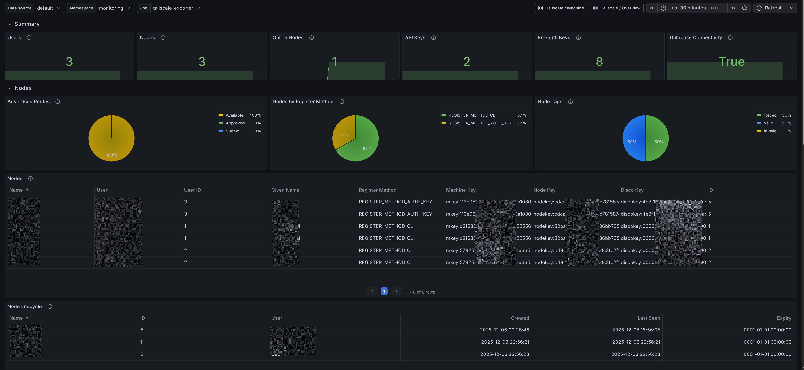

# Tailscale Exporter

A Prometheus exporter for Tailscale and Headscale that provides tailnet-level metrics using the Tailscale/Headscale API.

This repository also contains the `tailscale-mixin` that provides Prometheus alerts and rules and Grafana dashboard for tailnet-level metrics. You can find the dashboards in `./tailscale-mixin/dashboards_out/`.

The `tailscale-mixin` also has dashboards and alerts for client side `machine` metrics. You can find the dashboards in `./tailscale-mixin/dashboards_out/`. Jump to the [Client Side Machine Metrics](#client-side-machine-metrics) section for more information.

Tailscale:


Headscale:



## Overview

The exporter supports metrics from:
- Tailscale via the Tailscale API
- Headscale via the Headscale gRPC API

Dashboards and alerts for both are provided in the `tailscale-mixin`.

## Tailscale Features

- Comprehensive device metrics
- API key management (auth keys)
- DNS configuration
- User management
- Tailnet settings
- API health (Tailscale API accessibility)

## Headscale Features

- Node metrics (devices managed by Headscale)
- User and API key metrics
- Preauth keys metrics
- Headscale health status

## Installation

You can run the exporter to collect metrics from Tailscale (official cloud) and/or Headscale (self-hosted). Choose the path that matches your environment.

### Tailscale Installation

#### Authentication Setup

1. Go to the [Tailscale admin console](https://login.tailscale.com/admin/settings/keys)
2. Navigate to **Settings** → **Oauth Client**
3. Click on **Create new OAuth client**
4. Add read access for DNS, Devices, Users, and Keys
5. Copy the generated token (it's only shown once)

The following exact scopes are required:

```sh
devices:core:read
devices:posture_attributes:read
devices:routes:read
users:read
dns:read
auth_keys:read
feature_settings:read
policy_file:read
```

#### Tailscale Binary

Download the latest binary for Linux (amd64):

```bash
curl -L https://github.com/adinhodovic/tailscale-exporter/releases/latest/download/tailscale-exporter-linux-amd64 -o tailscale-exporter
chmod +x tailscale-exporter
```

Set up your Tailscale OAuth credentials and tailnet name (replace the placeholders with your actual values):

```bash
export TAILSCALE_OAUTH_CLIENT_ID="your-client-id"
export TAILSCALE_OAUTH_CLIENT_SECRET="your-client-secret"
export TAILSCALE_TAILNET="example.com"   # e.g. "mycompany.com" or "mytailnet.ts.net"
```

Run the exporter:

```bash
./tailscale-exporter
```

#### Docker Image

There's a Docker image available on Docker Hub: [tailscale-exporter](https://hub.docker.com/r/adinhodovic/tailscale-exporter).

Example with environment variables:

```bash
docker run -d --name tailscale-exporter -p 9250:9250 \
  -e TAILSCALE_OAUTH_CLIENT_ID="your-client-id" \
  -e TAILSCALE_OAUTH_CLIENT_SECRET="your-client-secret" \
  -e TAILSCALE_TAILNET="your-tailnet-name" \
  adinhodovic/tailscale-exporter:latest
```

#### Helm

A Helm chart is available in the `charts/tailscale-exporter` directory. You can install it using Helm:

```bash
helm install tailscale-exporter ./charts/tailscale-exporter \
  --set env.TAILSCALE_OAUTH_CLIENT_ID="your-client-id" \
  --set env.TAILSCALE_OAUTH_CLIENT_SECRET="your-client-secret" \
  --set env.TAILSCALE_TAILNET="your-tailnet-name"
```

### Headscale Installation


#### Authentication Setup

Create an API key in Headscale:

```bash
headscale apikey create "tailscale-exporter"
```

#### Binary

Set the required environment variables:

```bash
export HEADSCALE_ADDRESS="host:port"          # e.g. "headscale.example.com:50443" or "localhost:50443"
export HEADSCALE_API_KEY="your-api-key"       # required when HEADSCALE_ADDRESS is set
export HEADSCALE_INSECURE="false"             # set to "true" to allow plaintext gRPC (no TLS)
```

Run the exporter with Headscale enabled:

```bash
./tailscale-exporter \
  --headscale-address "$HEADSCALE_ADDRESS" \
  --headscale-api-key "$HEADSCALE_API_KEY" \
  -- headscale-inseucre "false"
```

#### Docker Image

Example with environment variables:

```bash
docker run -d --name tailscale-exporter -p 9250:9250 \
  -e HEADSCALE_ADDRESS="headscale.example.com:50443" \
  -e HEADSCALE_API_KEY="your-api-key" \
  -e HEADSCALE_INSECURE="false" \
  adinhodovic/tailscale-exporter:latest
```

You can combine Tailscale and Headscale in the same container by setting both sets of environment variables.

#### Helm

Install with Headscale settings:

```bash
helm install tailscale-exporter ./charts/tailscale-exporter \
  --set env.HEADSCALE_ADDRESS="headscale.example.com:50443" \
  --set env.HEADSCALE_API_KEY="your-api-key" \
  --set env.HEADSCALE_INSECURE="false"
```

## Usage

### Basic Usage

```bash
./tailscale-exporter
```

The exporter will start on port 9250 by default and expose metrics at `/metrics`.

### Command Line Options

```bash
./tailscale-exporter -h

Flags:
      --headscale-address string               Headscale gRPC address (can also be set via HEADSCALE_ADDRESS environment variable)
      --headscale-api-key string               Headscale API key (can also be set via HEADSCALE_API_KEY environment variable)
      --headscale-insecure                     Allow insecure (plaintext) gRPC connection to Headscale (can also be set via HEADSCALE_INSECURE environment variable)
  -h, --help                                   help for tailscale-exporter
  -l, --listen-address string                  Address to listen on for web interface and telemetry (default ":9250")
  -m, --metrics-path string                    Path under which to expose metrics (default "/metrics")
      --tailscale-oauth-client-id string       OAuth client ID (can also be set via TAILSCALE_OAUTH_CLIENT_ID environment variable)
      --tailscale-oauth-client-secret string   OAuth client secret (can also be set via TAILSCALE_OAUTH_CLIENT_SECRET environment variable)
  -t, --tailscale-tailnet string               Tailscale tailnet (can also be set via TAILSCALE_TAILNET environment variable)
```


## Prometheus Configuration

Add the following to your `prometheus.yml`:

```yaml
scrape_configs:
  - job_name: 'tailscale-exporter'
    static_configs:
      - targets: ['localhost:9250']
    scrape_interval: 30s
    metrics_path: /metrics
```


## Metrics

You can find the full list of metrics in the [METRICS.md](./docs/METRICS.md) file.

### Client Side Machine Metrics

This project also makes use of the [Tailscale's client side metrics](https://tailscale.com/kb/1482/client-metrics/) that are exposed by Tailscale clients. These metrics provide insights into individual devices connected to your tailnet.

The dashboards and alerts depend on the `tailscale_machine` label to exist, it makes filtering and grouping the metrics easier. Adding the label is fairly straightforward using Prometheus' `relabel_configs`. Here's an example configuration using the `ServiceMonitor` spec:

```yaml
spec:
  relabelings:
  - action: replace
    replacement: adin
    targetLabel: tailscale_machine
```
